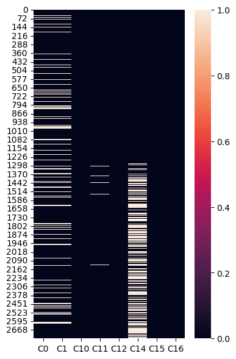
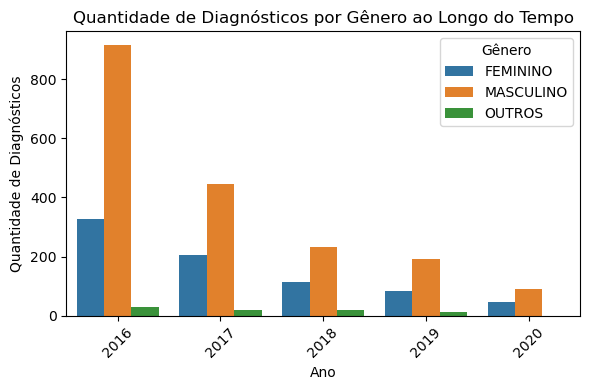
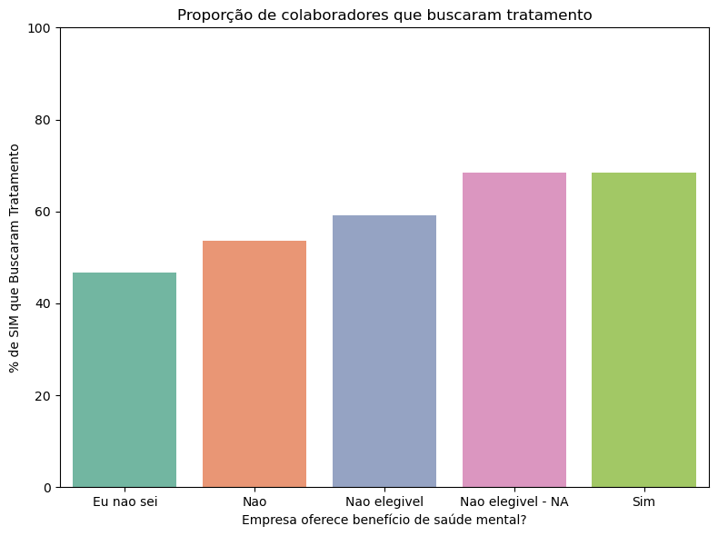

# Tech Mental Health — Data Collection & Integration Pipeline

A two-stage data pipeline: collect country data from a REST API and GDP data from a CSV, then clean five years of a mental-health-in-tech survey and join the two sources to compare countries.

## Overview

**Stage 1 — collection (`notebooks/01_data_collection.ipynb`)**
A local Flask REST API (`src/countries_api.py`) serves country records (name, capital, population, area, continent). The notebook consumes it with `requests`, parses the JSON into a DataFrame, reads World-Bank-style GDP data from CSV, joins both by country code and writes `data/processed/countries_gdp.csv` — 66 GDP years (1960–2021) plus country attributes.

**Stage 2 — cleaning and integration (`notebooks/02_cleaning_and_integration.ipynb`)**
Five survey files (2016–2020) with **different schemas** are loaded, positionally aligned to a common column index, tagged by year and concatenated. Then: age filtered to a valid 10–100 range, missing-value audit with heatmaps, imputation by mode on categorical columns, free-text gender answers normalised (Unicode NFKD → ASCII, dozens of spellings collapsed into three groups), and finally a join with the Stage 1 GDP table to answer country-level questions.

## Tech stack

`Python` · `pandas` · `NumPy` · `requests` · `Flask` · `Flask-RESTful` · `Seaborn` · `Matplotlib` · `unicodedata`

## Results

Six questions answered on the integrated dataset:

- **Treatment by gender (2016):** 76.1% of women who responded had sought professional treatment vs. 54.2% of men — a ~22-point gap that persists across the series.
- **Company benefits matter:** employees at companies offering mental-health benefits sought treatment at **68.4%**, against **46.7%** among those who did not know whether the benefit existed — the "don't know" group is the least assisted.
- **Country wealth:** in countries with above-average 2016 GDP, **80.5%** of respondents reported a diagnosis, vs. **68.9%** in the rest — consistent with better access to diagnosis rather than more illness.
- **Age:** diagnosis rates climb from 16.7% in the 10–19 bracket to ~49% among 20–29-year-olds.
- **Sample:** heavily male-skewed (916 men vs. 326 women in 2016) and shrinking year over year, which is stated as a limitation of the conclusions.

## Visuals

| Missing values before cleaning | Diagnoses by gender over time | Treatment vs. company benefit |
|---|---|---|
|  |  |  |

## How to run

```bash
python -m venv .venv
source .venv/bin/activate
pip install -r requirements.txt
```

Stage 1 needs the API running in a separate terminal:

```bash
python src/countries_api.py
```

It serves `http://127.0.0.1:5000/country`. With the API up, run `notebooks/01_data_collection.ipynb`, then `notebooks/02_cleaning_and_integration.ipynb`.

## Data

- `src/country.json` — country records served by the local API.
- `data/raw/gdp_data.csv` — GDP in current US$ per country per year (1960–2021), World Bank format.
- `data/raw/survey/survey_2016.csv` … `survey_2020.csv` — mental-health-in-tech survey, one file per year, Portuguese question headers, schemas differing between years.
- `data/processed/countries_gdp.csv` — Stage 1 output, consumed by Stage 2.

All data is versioned here, so both notebooks run end to end after cloning.

## Project structure

```
├── src
│   ├── countries_api.py   # Flask-RESTful API serving country records
│   └── country.json       # data behind the API
├── data
│   ├── raw/gdp_data.csv
│   ├── raw/survey/survey_2016..2020.csv
│   └── processed/countries_gdp.csv
├── notebooks
│   ├── 01_data_collection.ipynb        # API + CSV -> joined table
│   └── 02_cleaning_and_integration.ipynb  # survey cleaning + GDP join
└── reports/figures
```

> Analysis and comments inside the notebooks are written in Brazilian Portuguese.
